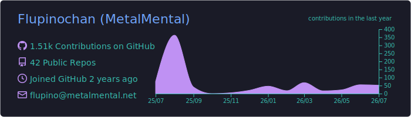
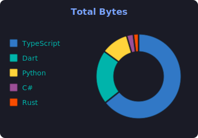
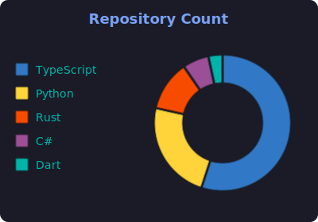
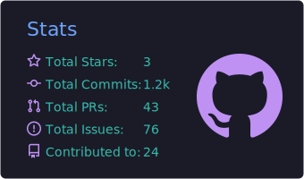
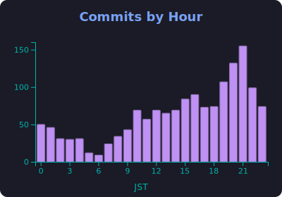

    

## Hi 👋, I'm MetalMental (^^♪
### I am an engineer who likes pixel art

- [MyBlog](https://www.metalmental.net/)
- [Zenn](https://zenn.dev/metalmental)
- [Youtube](https://www.youtube.com/@Flupinochan/)

  
  

  
  

## 🤝 Contributions

- [nulab/backlog-mcp-server](https://github.com/nulab/backlog-mcp-server/pull/120)
